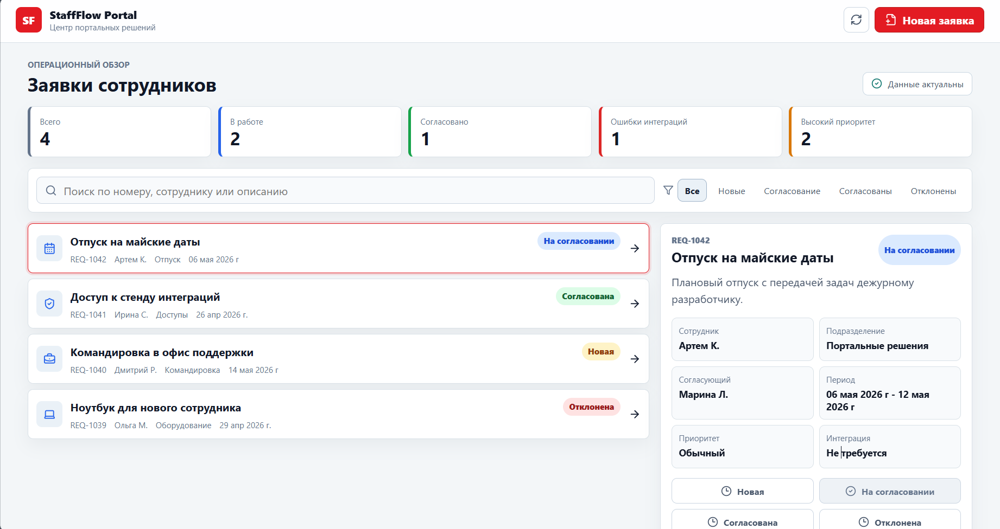

# StaffFlow Portal




Учебный React/TypeScript проект под роль Junior web разработчика в продуктовой команде.

StaffFlow Portal имитирует внутренний портал банка: сотрудники создают заявки на отпуск, командировки, доступы и оборудование, а команда портальных решений видит статусы, ошибки интеграций и историю согласования.

## Что реализовано

- React + TypeScript приложение на Vite
- Управление состоянием через Effector
- UI на styled-components
- Моковый REST API с задержками, ошибками и обновлением данных
- Поиск, фильтрация и статусы заявок
- Форма создания заявки с валидацией
- Детальная панель заявки с историей согласования
- Обработка loading/error/success состояний
- Юнит-тесты Jest для Effector-модели

## Стек

React, TypeScript, Effector, effector-react, styled-components, Jest, Testing Library, Vite.

## Как запустить

```bash
npm install
npm run dev
```

## Проверки

```bash
npm run typecheck
npm test
npm run build
```


